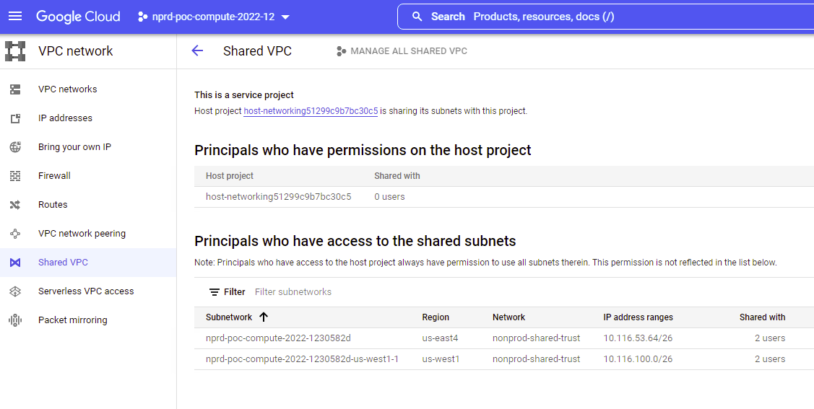
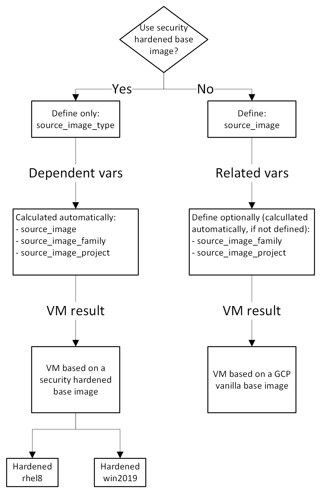

# terraform-google-dnb_gcp_compute_engine

Module to encompass most GCE use-cases.

Current use-cases supported:
- Provision managed instance group (stateful|stateless)
- Use of security hardened base images when defining `source_image_type` TF var (`rhel8|win2019`)

## Attribution
Large sections of code copied from: https://raw.githubusercontent.com/terraform-google-modules/terraform-google-vm/master/examples/


## Quick Start

Test module locally:
```
make test
```

Apply configuration to currently configured/authenticated AWS ENV:
```
make test-apply
```

## Module Documentation

### Use cases

We cover 2 basic use cases that demonstrate how to create a VM in regards to its base image:

| # | Use case           | Description                                                    |
|---|--------------------|----------------------------------------------------------------|
| 1 | `linux`            | Creates a Linux VM using a security hardened image `rhel8`     |
| 2 | `windows`          | Creates a Windows VM using a security hardened image `win2019` |

### Base images

| Base image type         | Managed by | Main features                                           |
|-------------------------|------------|---------------------------------------------------------|
| Security hardened image | DnB        | CIS benchmark security controls + DnB security controls |
| Google vanilla image    | Google     | Standard vanilla base images provided by Google         |

- We use Packer in order to control the life cycle of the security hardened images
- It means we build the base images, push into the registry, tag, and promote them using distribution channels according to its production readiness level
- The suggested workflow is that we always spin up a security hardened VM

### HashiCorp Packer (HCP) image channels

Channels work like tags for images built with Packer, this way we can reference existing image builds using a custom namespacing strategy.

The following table contains the HCP channels that we use in order to tag our images, considering the different production readiness level of the image Vs. operating system version:

| HCP channel | OS      | Version                    | Image name            |
|-------------|---------|----------------------------|-----------------------|
| dev         | Linux   | Red Hat Enterprise Linux 8 | platform-rhel8-base   |
| nonprod     | Linux   | Red Hat Enterprise Linux 8 | platform-rhel8-base   |
| testing     | Linux   | Red Hat Enterprise Linux 8 | platform-rhel8-base   |
| dev         | Windows | CIS Windows Server 2019    | platform-win2019-base |
| nonprod     | Windows | CIS Windows Server 2019    | platform-win2019-base |

#### TF var `environment` controversy

According to the TF var description about [environment](https://github.com/dnb-main/terraform-google-dnb_gcp_compute_engine/blob/main/variables.tf#L18):

```
The GCP environment where instances will be deployed.
```

This description is inaccurate, because the variable `environment` provides information about which HCP channel should be used in order to pickup the base image, and in fact it doesn't define which environment the deploy is going to happen.


### Shared VPC network:  required variables

There are some required VPC shared network TF variables:

| Terraform variable      | Shared VPC field                                                                |
|-------------------------|---------------------------------------------------------------------------------|
| `subnetwork_project_id` | "Host project" entry from "Principals who have permissions on the host project" |
| `subnetwork`            | "Subnetwork" entry from "Principals who have access to the shared subnets"      |
| `region`                | Should match the same region where the shared `subnetwork` is contained         |

In order to find the right values for these variables, on the GCP Console, go to:

1. The project you need to run the deployment
1. "VPC networks" tab
1. "Shared VPC" sub tab

Compare to the following screenshot and capture the required info:



Please notice that while picking a value for `subnetwork`, we need to make sure it belongs to the same `region` informed, otherwise there will be a failure during the deployment.

Also, because we need to use a shared VPC network model, we are not supposed to use this terraform module with projects that don't have this feature enabled (eg:  any projects that belong to sandbox environment).

### Base image:  required variables

#### Selecting a security hardened base image built by DnB

- This sub section describes what it takes to provision a VM that features security hardening by design.

- The Terraform variable `source_image_type` determines if we are going to spin either a Linux or a Windows VM.

- Both types of VMs are based on security hardened images that follow the [CIS benchmark](https://console.cloud.google.com/marketplace/browse?q=center%20for%20internet%20security).  On top of that, we add extra custom security controls that are unique to DnB.

When defining the image type, there are only 2 acceptable values:

| `source_image_type` | Default?|
|---------------------|---------|
| `rhel8`             | Yes     |
| `win2019`           | No      |

Once we set either `rhel8` or `win2019` for the TF var `source_image_type` there's no need to set any other TF vars that are specific to the base image.

#### Workflow decision for selecting the base image

The following diagram contains the workflow decision we can take in order to determine which set of variables we should use/define:



It's important to notice that there are no guard rails in place enforcing the usage of security hardened base images, so please make sure to have a proper evaluation of the VM requirements before using any vanilla base image.

## OS Patching
This module uses https://github.com/dnb-main/terraform-google-dnb_gcp_os_config_patch_deployment to enable OS Patching jobs. Full documentation available here https://cloud.google.com/compute/docs/os-patch-management

## Contributing


<!-- BEGINNING OF PRE-COMMIT-TERRAFORM DOCS HOOK -->
## Requirements

| Name | Version |
|------|---------|
| <a name="requirement_terraform"></a> [terraform](#requirement\_terraform) | >= 1.1.0 |
| <a name="requirement_google"></a> [google](#requirement\_google) | ~> 4.0 |
| <a name="requirement_google-beta"></a> [google-beta](#requirement\_google-beta) | ~> 4.0 |
| <a name="requirement_hcp"></a> [hcp](#requirement\_hcp) | ~> 0.49.0 |

## Providers

| Name | Version |
|------|---------|
| <a name="provider_google"></a> [google](#provider\_google) | ~> 4.0 |
| <a name="provider_hcp"></a> [hcp](#provider\_hcp) | ~> 0.49.0 |

## Modules

| Name | Source | Version |
|------|--------|---------|
| <a name="module_dnb_gcp_os_config_patch_deployment"></a> [dnb\_gcp\_os\_config\_patch\_deployment](#module\_dnb\_gcp\_os\_config\_patch\_deployment) | app.terraform.io/dnb-core/dnb_gcp_os_config_patch_deployment/google | 0.1.0 |
| <a name="module_dnb_gcp_shared_constants"></a> [dnb\_gcp\_shared\_constants](#module\_dnb\_gcp\_shared\_constants) | app.terraform.io/dnb-core/dnb_gcp_shared_constants/google | 1.8.0 |
| <a name="module_instance_template"></a> [instance\_template](#module\_instance\_template) | terraform-google-modules/vm/google//modules/instance_template | 7.9.0 |
| <a name="module_mig"></a> [mig](#module\_mig) | terraform-google-modules/vm/google//modules/mig | 7.6.0 |

## Resources

| Name | Type |
|------|------|
| [google_project_service.compute](https://registry.terraform.io/providers/hashicorp/google/latest/docs/resources/project_service) | resource |
| [google_compute_default_service_account.default](https://registry.terraform.io/providers/hashicorp/google/latest/docs/data-sources/compute_default_service_account) | data source |
| [hcp_packer_image.image](https://registry.terraform.io/providers/hashicorp/hcp/latest/docs/data-sources/packer_image) | data source |
| [hcp_packer_iteration.image](https://registry.terraform.io/providers/hashicorp/hcp/latest/docs/data-sources/packer_iteration) | data source |

## Inputs

| Name | Description | Type | Default | Required |
|------|-------------|------|---------|:--------:|
| <a name="input_additional_disks"></a> [additional\_disks](#input\_additional\_disks) | List of maps of additional disks. See https://www.terraform.io/docs/providers/google/r/compute_instance_template.html#disk_name | <pre>list(object({<br>    disk_name    = string<br>    device_name  = string<br>    auto_delete  = bool<br>    boot         = bool<br>    disk_size_gb = number<br>    disk_type    = string<br>    disk_labels  = map(string)<br>  }))</pre> | `[]` | no |
| <a name="input_auto_delete"></a> [auto\_delete](#input\_auto\_delete) | Whether or not the disk should be auto-deleted | `string` | `"false"` | no |
| <a name="input_autoscaling_cpu"></a> [autoscaling\_cpu](#input\_autoscaling\_cpu) | Autoscaling, cpu utilization policy block as single element array. https://www.terraform.io/docs/providers/google/r/compute_autoscaler.html#cpu_utilization | `list(map(number))` | `[]` | no |
| <a name="input_autoscaling_enabled"></a> [autoscaling\_enabled](#input\_autoscaling\_enabled) | Creates an autoscaler for the managed instance group | `bool` | `false` | no |
| <a name="input_autoscaling_lb"></a> [autoscaling\_lb](#input\_autoscaling\_lb) | Autoscaling, load balancing utilization policy block as single element array. https://www.terraform.io/docs/providers/google/r/compute_autoscaler.html#load_balancing_utilization | `list(map(number))` | `[]` | no |
| <a name="input_autoscaling_metric"></a> [autoscaling\_metric](#input\_autoscaling\_metric) | Autoscaling, metric policy block as single element array. https://www.terraform.io/docs/providers/google/r/compute_autoscaler.html#metric | <pre>list(object({<br>    name   = string<br>    target = number<br>    type   = string<br>  }))</pre> | `[]` | no |
| <a name="input_autoscaling_scale_in_control"></a> [autoscaling\_scale\_in\_control](#input\_autoscaling\_scale\_in\_control) | Autoscaling, scale-in control block. https://www.terraform.io/docs/providers/google/r/compute_autoscaler.html#scale_in_control | <pre>object({<br>    fixed_replicas   = number<br>    percent_replicas = number<br>    time_window_sec  = number<br>  })</pre> | <pre>{<br>  "fixed_replicas": 0,<br>  "percent_replicas": 30,<br>  "time_window_sec": 600<br>}</pre> | no |
| <a name="input_cooldown_period"></a> [cooldown\_period](#input\_cooldown\_period) | The number of seconds that the autoscaler should wait before it starts collecting information from a new instance. | `number` | `60` | no |
| <a name="input_disk_labels"></a> [disk\_labels](#input\_disk\_labels) | Labels to be assigned to boot disk, provided as a map | `map` | `{}` | no |
| <a name="input_disk_size_gb"></a> [disk\_size\_gb](#input\_disk\_size\_gb) | Disk size in GB | `string` | `"30"` | no |
| <a name="input_disk_type"></a> [disk\_type](#input\_disk\_type) | Disk type, can be either pd-ssd, local-ssd, or pd-standard | `string` | `"pd-standard"` | no |
| <a name="input_distribution_policy_zones"></a> [distribution\_policy\_zones](#input\_distribution\_policy\_zones) | The distribution policy, i.e. which zone(s) should instances be create in. Default is all zones in given region. | `list(string)` | `[]` | no |
| <a name="input_enable_os_patch_deployment"></a> [enable\_os\_patch\_deployment](#input\_enable\_os\_patch\_deployment) | Deploys a patch schedule. | `bool` | `true` | no |
| <a name="input_environment"></a> [environment](#input\_environment) | The GCP environment where instances will be deployed. | `string` | `"non_prod"` | no |
| <a name="input_hcp_client_id"></a> [hcp\_client\_id](#input\_hcp\_client\_id) | Client ID to interact with HCP products | `string` | `""` | no |
| <a name="input_hcp_client_secret"></a> [hcp\_client\_secret](#input\_hcp\_client\_secret) | Client Secret to interact with HCP products | `string` | `""` | no |
| <a name="input_health_check"></a> [health\_check](#input\_health\_check) | Health check to determine whether instances are responsive and able to do work | <pre>object({<br>    type                = string<br>    initial_delay_sec   = number<br>    check_interval_sec  = number<br>    healthy_threshold   = number<br>    timeout_sec         = number<br>    unhealthy_threshold = number<br>    response            = string<br>    proxy_header        = string<br>    port                = number<br>    request             = string<br>    request_path        = string<br>    host                = string<br>  })</pre> | <pre>{<br>  "check_interval_sec": 30,<br>  "healthy_threshold": 1,<br>  "host": "",<br>  "initial_delay_sec": 30,<br>  "port": 80,<br>  "proxy_header": "NONE",<br>  "request": "",<br>  "request_path": "/",<br>  "response": "",<br>  "timeout_sec": 10,<br>  "type": "http",<br>  "unhealthy_threshold": 5<br>}</pre> | no |
| <a name="input_hostname"></a> [hostname](#input\_hostname) | Hostname prefix for instances. | `string` | `"default"` | no |
| <a name="input_labels"></a> [labels](#input\_labels) | Labels, provided as a map | `map(string)` | `{}` | no |
| <a name="input_machine_type"></a> [machine\_type](#input\_machine\_type) | Machine type to create, e.g. n1-standard-1 | `string` | `"f1-micro"` | no |
| <a name="input_max_replicas"></a> [max\_replicas](#input\_max\_replicas) | The maximum number of instances that the autoscaler can scale up to. This is required when creating or updating an autoscaler. The maximum number of replicas should not be lower than minimal number of replicas. | `number` | `10` | no |
| <a name="input_metadata"></a> [metadata](#input\_metadata) | Metadata, provided as a map. It could be used to add windows Startup script by adding Key:windows-startup-script-ps1 and Value:YOUR\_POWERSHELL\_SCRIPT. | `map(string)` | `{}` | no |
| <a name="input_min_replicas"></a> [min\_replicas](#input\_min\_replicas) | The minimum number of replicas that the autoscaler can scale down to. This cannot be less than 0. | `number` | `2` | no |
| <a name="input_named_ports"></a> [named\_ports](#input\_named\_ports) | Named name and named port | <pre>list(object({<br>    name = string<br>    port = number<br>  }))</pre> | `[]` | no |
| <a name="input_os_patch_day_of_the_week"></a> [os\_patch\_day\_of\_the\_week](#input\_os\_patch\_day\_of\_the\_week) | Day(MONDAY to SUNDAY) of the week to apply patches. | `string` | n/a | yes |
| <a name="input_os_patch_deployment_id"></a> [os\_patch\_deployment\_id](#input\_os\_patch\_deployment\_id) | Patch job name. | `string` | `""` | no |
| <a name="input_os_patch_hours_of_the_day"></a> [os\_patch\_hours\_of\_the\_day](#input\_os\_patch\_hours\_of\_the\_day) | Hour(0 to 24) of the day to apply patches. | `number` | n/a | yes |
| <a name="input_os_patch_minutes_of_the_day"></a> [os\_patch\_minutes\_of\_the\_day](#input\_os\_patch\_minutes\_of\_the\_day) | Minutes(0 to 59) of the day to apply patches. | `number` | n/a | yes |
| <a name="input_os_patch_week_of_the_month"></a> [os\_patch\_week\_of\_the\_month](#input\_os\_patch\_week\_of\_the\_month) | Week(1 to 4) of the Month to apply patches. | `number` | n/a | yes |
| <a name="input_project_id"></a> [project\_id](#input\_project\_id) | The GCP project to use for integration tests | `string` | n/a | yes |
| <a name="input_region"></a> [region](#input\_region) | The GCP region where instances will be deployed. | `string` | `"us-east4"` | no |
| <a name="input_service_account"></a> [service\_account](#input\_service\_account) | Service account to attach to the instance. See https://www.terraform.io/docs/providers/google/r/compute_instance_template.html#service_account. | <pre>object({<br>    email  = string<br>    scopes = set(string)<br>  })</pre> | `null` | no |
| <a name="input_source_image"></a> [source\_image](#input\_source\_image) | Source disk image. If not specified, defaults to the data from HCP Packer. | `string` | `""` | no |
| <a name="input_source_image_family"></a> [source\_image\_family](#input\_source\_image\_family) | Source image family. If not specified, defaults to the data from HCP Packer. | `string` | `""` | no |
| <a name="input_source_image_project"></a> [source\_image\_project](#input\_source\_image\_project) | Project where the source image comes from. If not specified, defaults to the data from HCP Packer. | `string` | `""` | no |
| <a name="input_source_image_type"></a> [source\_image\_type](#input\_source\_image\_type) | Source image type. Defaults to rhel8. | `string` | `"rhel8"` | no |
| <a name="input_startup_script"></a> [startup\_script](#input\_startup\_script) | User startup script to run when instances spin up. For windows Powershell scrip, we have to use metadata variable to pass in the script file. | `string` | `""` | no |
| <a name="input_stateful_disks"></a> [stateful\_disks](#input\_stateful\_disks) | Disks created on the instances that will be preserved on instance delete. https://cloud.google.com/compute/docs/instance-groups/configuring-stateful-disks-in-migs | <pre>list(object({<br>    device_name = string<br>    delete_rule = string<br>  }))</pre> | `[]` | no |
| <a name="input_subnetwork"></a> [subnetwork](#input\_subnetwork) | Subnet to deploy to. Only one of network or subnetwork should be specified. | `string` | `""` | no |
| <a name="input_subnetwork_project_id"></a> [subnetwork\_project\_id](#input\_subnetwork\_project\_id) | The project that subnetwork belongs to | `string` | `""` | no |
| <a name="input_tags"></a> [tags](#input\_tags) | Network tags, provided as a list | `list(string)` | <pre>[<br>  "ssh-in"<br>]</pre> | no |
| <a name="input_target_pools"></a> [target\_pools](#input\_target\_pools) | The target load balancing pools to assign this group to. | `list(string)` | `[]` | no |
| <a name="input_target_size"></a> [target\_size](#input\_target\_size) | The target number of running instances for this managed or unmanaged instance group. This value should always be explicitly set unless this resource is attached to an autoscaler, in which case it should never be set. | `number` | `2` | no |
| <a name="input_update_policy"></a> [update\_policy](#input\_update\_policy) | The rolling update policy. https://registry.terraform.io/providers/hashicorp/google/latest/docs/resources/compute_instance_group_manager | <pre>list(object({<br>    max_surge_fixed              = number<br>    instance_redistribution_type = string<br>    max_surge_percent            = number<br>    max_unavailable_fixed        = number<br>    max_unavailable_percent      = number<br>    min_ready_sec                = number<br>    replacement_method           = string<br>    minimal_action               = string<br>    type                         = string<br>  }))</pre> | <pre>[<br>  {<br>    "instance_redistribution_type": "PROACTIVE",<br>    "max_surge_fixed": 3,<br>    "max_surge_percent": null,<br>    "max_unavailable_fixed": 0,<br>    "max_unavailable_percent": null,<br>    "min_ready_sec": 50,<br>    "minimal_action": "REPLACE",<br>    "replacement_method": "SUBSTITUTE",<br>    "type": "PROACTIVE"<br>  }<br>]</pre> | no |

## Outputs

| Name | Description |
|------|-------------|
| <a name="output_instance_template_name"></a> [instance\_template\_name](#output\_instance\_template\_name) | Name of instance template |
| <a name="output_instance_template_self_link"></a> [instance\_template\_self\_link](#output\_instance\_template\_self\_link) | Self-link of instance template |
| <a name="output_instance_template_tags"></a> [instance\_template\_tags](#output\_instance\_template\_tags) | Tags that will be associated with instance(s) |
| <a name="output_mig_health_check_self_links"></a> [mig\_health\_check\_self\_links](#output\_mig\_health\_check\_self\_links) | An instance of google\_compute\_region\_instance\_group\_manager of the instance group. |
| <a name="output_mig_instance_group"></a> [mig\_instance\_group](#output\_mig\_instance\_group) | Self-link of managed instance group |
| <a name="output_mig_instance_group_manager"></a> [mig\_instance\_group\_manager](#output\_mig\_instance\_group\_manager) | An instance of google\_compute\_region\_instance\_group\_manager of the instance group. |
| <a name="output_mig_self_link"></a> [mig\_self\_link](#output\_mig\_self\_link) | Self-link for managed instance group |
<!-- END OF PRE-COMMIT-TERRAFORM DOCS HOOK -->
