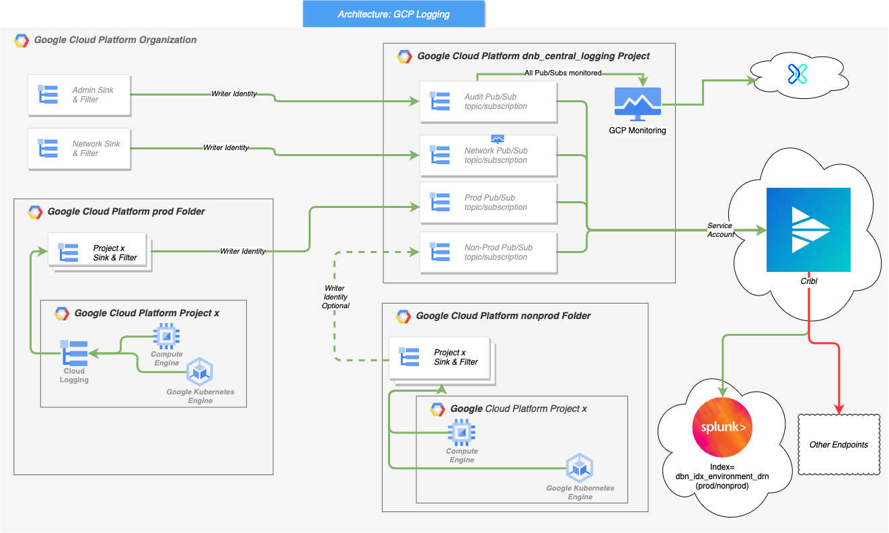

# GCP Central logging

This is intended to setup a centralized, org-level logging sink and point it to PubSub for exporting to Splunk.

Author
: [Dima gromov](https://github.com/gromovd_dnbgit); [Chandra Chitturi](https://github.com/chitturic_dnbgit) July 2022

## Details
This Project creates:
|Topic(s)	|Sink(s)	|Filter(s)	|Description|
|--------------|-------------------|------------------------|-----------------------------------|
|org-logs-admin-topic	|org-logs-admin-sink2pubpub	|logName:cloudaudit OR logName:externalaudit	|Topic and sink is created for org level to ingest audit events|
|org-logs-network-topic	|org-logs-network-sink2pubsub	|logName:vpc_flows OR logName:firewall	|Topic and sink is created for org level to ingest network/firewall events|
|org-logs-nonprod-topic|	{project_id}-sink2pubsub	|resource.labels.project_id={project_id} and not admin/network events|Sinks are created for each project_id from list of project_id(s) in nonprod environment; to get project_id added to this list please refer to "Project Level ingestion"|
|org-logs-prod-topic	|{project_id}-sink2pubsub 	|resource.labels.project_id={project_id} and not admin/network events|Sinks are created for each project_id from list of project_id(s) in nonprod environment; to get project_id added to this list please refer to "Project Level ingestion"|

* For each "topic", roles: "roles/pubsub.subscriber & roles/pubsub.viewer" are granted to Cribl service account, so Cribl can read events from the tpic.
* When a sink is created, a default writer_identity is also created for that sink.  This setup will identity the writer_identity for each of the sink and greants publisher role: "roles/pubsub.publisher" to it(s) respective topic

### Project Level ingestion
As we are still evolving the process of automating the log ingestion, for now application team needs to work with Observability team (for each project_id) to get the events ingested into Splunk for their respective project(s).  Steps inolve:
1. Check if dnb_idx_nonprod_{drn} and dnb_idx_prod_{drn} indexes already exist, if not app team needs to submit a new request to create indexes for the DRN (Ex: dnb_idx_nonprod_2222 and dnb_idx_prod_2222 where 2222 is the drn.
2. App team needs to submit PR to our project to include the project
3. Observability team will add the routing to the index for the events coming from resource.labels.project_id={project_id}, this still still needs to be automated.

# Outcome
Events are forwarded to Splunk index: dnb_inx_{environment}_{drn}, where environment can be nonprod or prod and drn is the four digit drn number the product is associated with.   
Indexing events into Splunk to an index specific to a DRN will provide better manageability of data retention

# Monitoring and alerting of Centralized Logging pipeline
To make sure the delivery of messages from GCP to destination (in this case, Splunk) through PubSub and Cribl, we have enabled monitoring and alerting in place from two areas.

From GCP: Central Logging terraform code includes alerts.tf this is to monitor the events in PubSub topic(s) are acknowledged by the subscriber (Cribl) in timely manner and notify responsible parties when the age of unacknowledged messages in PubSub subscription are over 10 minutes for any given "subscription". Notification will be sent out from GCP to Observability SRE team to troubleshoot the issue through XMatters platform.

From Splunk: Alerts are created in Splunk Cloud platform to check every 10 minutes for the recent event from each Cribl pipeline. Threshold is now set to 20 minutes for triggering an alert to responsible parties. When there are no new events ingested in last 20 minutes from the four pipelines described in the types of logs section of this document, an email notification will be sent out to Observability SRE team to investigate and resolve the issue. Notification through XMatters platform is still in testing phase.

## Logs consumer

Log events in PubSub will be consumed by [Cribl Stream](https://cribl.io/stream/) via polling every 1 minute, processing events and forwarding them to Splunk.

## References

[Configure aggregated sinks  |  Cloud Logging  |  Google Cloud](https://cloud.google.com/logging/docs/export/aggregated_sinks)

[Scenarios for exporting Cloud Logging data: Splunk  |  Cloud Architecture Center  |  Google Cloud](https://cloud.google.com/architecture/exporting-stackdriver-logging-for-splunk)

[Available logs  |  Cloud Logging  |  Google Cloud](https://cloud.google.com/logging/docs/view/available-logs)

[Google services with audit logs  |  Cloud Logging  |  Google Cloud](https://cloud.google.com/logging/docs/audit/services)

# Terraform Documentation
<!-- BEGINNING OF PRE-COMMIT-TERRAFORM DOCS HOOK -->
## Requirements

No requirements.

## Providers

No providers.

## Modules

No modules.

## Resources

No resources.

## Inputs

No inputs.

## Outputs

No outputs.
<!-- END OF PRE-COMMIT-TERRAFORM DOCS HOOK -->
