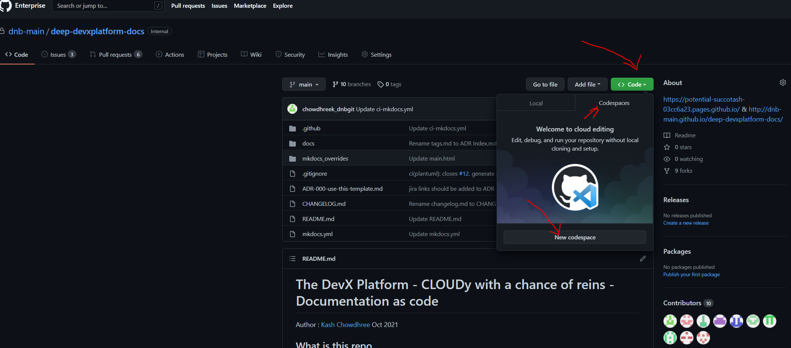
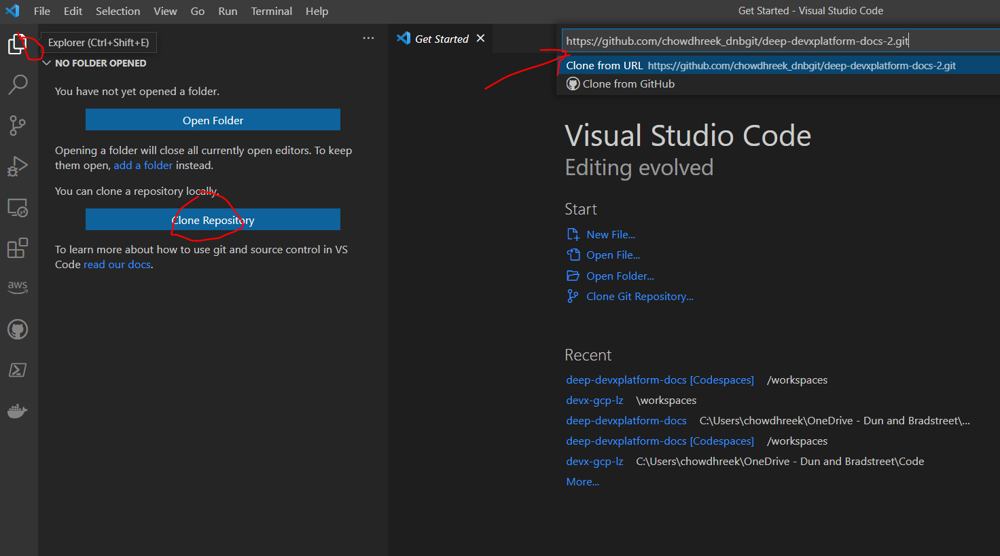

# repo-template-generic-bootstrapper_devx
Update this repo title to your actual repo title, followed by a short description of the purpose.

Everything below is sample instructions to include in your repo plus a description of what this template repo actually is, you should remove it in your repo clone of this template.

<br>

Author
: [Kash Chowdhree](https://github.com/chowdhreek_dnbgit) Mar 2022

<br>

## What is this repo
This is a template for anyone in D&B creating new repos in our GitHub Enterprise Account.

It contains sample code, unit tests, folder structue and a few plugins that you MAY want to use and convetions to follow. Nothing is mandatory EXCEPT the drn tag and the snyk and chermarx github actions.

This is an example of a curated opinionated provisioning for new repos via http://devx portal with bootstrapping of plugins and GitHub actions workflows for release versioning, security scanning, naming, branching, DRN topic tag for CMDB identification, docs, sample tests, linting and make file, main branch protection rules (to require a PR to merge to main) and directory layout for src code and terraform.


<br>

## 1. Sample quick start guide for using your newly minted repo
### Option 1. Browser-based cloud IDE (no install needed!)
This approach will fork this repo and setup github auth tokens automatically to give you a full blown linux terminal with code tools pre-installed so is a very light way to get started coding without needing to install anything:

1. Open this Github repo in a web browser: [devx-<YOUR_REPO_NAME>](https://github.com/dnb-main/devx-<YOUR_REPO_NAME>)
1. Click on the `Code` button
1. Click on `Open with Codespaces`
1. Click on the `New codespace` button
        
1. A window will appear creating your codespace:

  - You can either: 
     - let it start VScode in your browser, or
     - click "open desktop VScode" if you have that installed on your laptop
  - Open a terminal in Codespaces by pressing:

         ctl + `
         
To later manage your codespaces, visit the [Github Codespaces page](https://github.com/codespaces)

<br>

### Option 2. Using your local dev env (need your own IDE, and auth to GitHub)

1. Fork this repository in github by clicking here: https://github.com/dnb-main/devx-<YOUR_REPO_NAME>/fork
1. Clone that fork to your local computer, e.g. in a VScode click the explorer icon on the top left and press the "clone repository" button, then enter your repo URL from the forked GitHub page, e.g.

        git clone https://github.com/<YOUR_GITHUB_ACCOUNT>/devx-<YOUR_REPO_NAME>
 

 
<br>

## 2. Contributing
### 1. Sync with the upstream
This is important to do regularly because if the repo has been edited by someone else since you forked it you need to bring your fork up to date before you can contribute changes:

        git remote add upstream https://github.com/dnb-main/devx-<YOUR_REPO_NAME>
        git fetch upstream
        git pull --rebase upstream main

<br>

### 2. (OPTIONAL) Create new branch and ADR from template
#### When to use branches
  * a branch on your fork allows for concurrent change isolation and makes it easier to keep fork/main in sync w/ upstream/main
  * additional commits to fork/main after a pull request is opened may result in additional changes, not intended to be part of the change, to become part of that pull request
  * this is often needed when multiple pull requests are open in parallel against the same upstream repository

A common delimitation between branch, fork, upstream would be:

  * branches - scope for a change set, buffers against cross pollination of changesets.
  * fork - scope for a contributor, buffers against tainting upstream project, forced pushes and deletions
  * upstream - source of truth for a projects development/ production state

Choose a suitable branch name, e.g. develop

        git checkout -b <YOUR_BRANCH_NAME> 

Just remeber that in section 4 below you'll need to run this too:

        git push --set-upstream origin <YOUR_BRANCH_NAME> 

<br>

### 3. Run some tests

```
make test
```

### 4. Commit & pull/sync with main
1. Make your changes, commit them with a message, and then push to your upstream fork

        git add .
        git commit -am "Updated ADR-123 with further detail in the decision section"
        git pull --rebase upstream main
        git push origin

### 5. Create a pull request
Preferably, change one major thing per pull request. See the Codereviewers fle for those that are automatically notified to approve the PR and can merge it.

<br>

#### Option 1. (in codespaces VScode) 
In the Activity Bar on the left click the GitHub Icon and that will open the Pull Requests navigation -> click the new Pull Request icon

<br>

#### Option 2. (at github.com) 
Alternatively you can open your fork in github at `https://github.com/<YOUR_GITHUB_ACCOUNT>/devx-<YOUR_REPO_NAME>` and click "create a pull request" in the pull reqest tab after selecting your branch. Click send pull request.


<br>


## Bonus tip: Diagrams as code
1. Use Mermaid as it's not got built-in support from GitHub
1. or you can deploy a GitHub action, like for plantuml, if that's your prefered diagramming language.

C4model is a good standard to use for diagramming, especially as part of http://arp

<br><br>

# Terraform Documentation
<!-- BEGINNING OF PRE-COMMIT-TERRAFORM DOCS HOOK -->
## Requirements

No requirements.

## Providers

No providers.

## Modules

No modules.

## Resources

No resources.

## Inputs

No inputs.

## Outputs

No outputs.
<!-- END OF PRE-COMMIT-TERRAFORM DOCS HOOK -->
